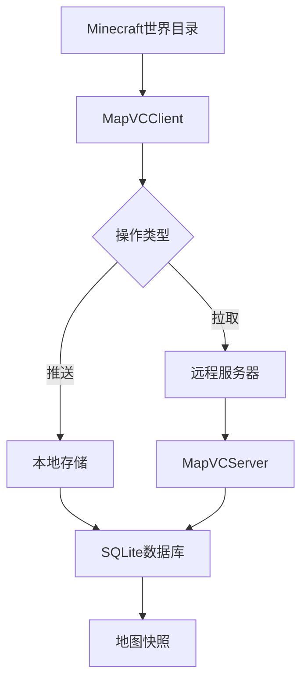
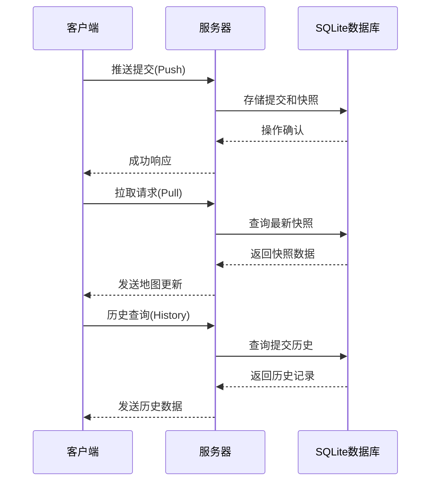
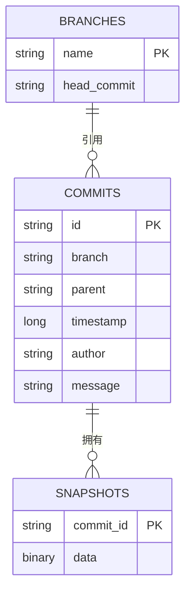

# MapVCS - Minecraft地图版本控制系统

MapVCS是一个专为Minecraft设计的分布式地图版本控制系统，允许玩家和服务器管理员轻松管理地图变更、协作开发和回滚版本。

## 功能亮点

- ✅ 地图快照版本控制
- ✅ 分支管理与提交历史
- ✅ 分布式架构（本地/远程操作）
- ✅ 增量更新与差异管理
- ✅ 命令行工具集成



## 快速开始

### 系统要求
- Java 8
- Minecraft Java版世界目录

### 文件结构准备
```
E:\minecraft\vcstest
├── server/          # 服务器文件
├── client/          # 客户端文件
└── world/           # Minecraft世界目录
```

### 1. 启动服务器
```bash
# 在server目录中
java -jar mapvcs-server.jar
```
服务器将在`localhost:9090`(TCP)和`localhost:9091`(HTTP)启动<br>
使用云服务器注意在云服务器管理中放行相关端口

### 2. 客户端初始化
```bash
# 在client目录中
java -jar mapvcs-client.jar E:\minecraft\vcstest\world init
```

### 3. 查看当前状态
```bash
java -jar mapvcs-client.jar E:\minecraft\vcstest\world
```

## 完整使用指南

### 初始化仓库
```bash
java -jar mapvcs-client.jar <世界路径> init
```
示例：
```bash
java -jar mapvcs-client.jar E:\minecraft\vcstest\world init
```

### 推送更改（仅本地）
```bash
java -jar mapvcs-client.jar <世界路径> push -m "添加新城堡" -a "Steve"
```
示例：
```bash
java -jar mapvcs-client.jar E:\minecraft\vcstest\world push -m "扩建下界要塞" -a "Alex"
```

### 拉取更新
```bash
java -jar mapvcs-client.jar <世界路径> pull
```
示例输出：
```
Pulled successfully!
New commit: a3f8b2c1
Updated files: [region/r.0.0.mca, level.dat]
```

### 查看历史
```bash
java -jar mapvcs-client.jar <世界路径> history -l 5
```
示例输出：
```
Commit History:
[a3f8b2c1] Alex - Fri Jun 09 14:30:25 CST 2023
  扩建下界要塞
[f8e2d1a9] Steve - Thu Jun 08 10:15:42 CST 2023
  修复村庄bug
[7b3c4d0f] Alex - Wed Jun 07 09:20:33 CST 2023
  添加海洋纪念碑
```

### 高级分支管理
创建新分支：
```bash
java -jar mapvcs-client.jar E:\minecraft\vcstest\world -b "nether_expansion"
```

切换分支：
```bash
java -jar mapvcs-client.jar E:\minecraft\vcstest\world -b "main"
```

## 系统架构



## 技术实现

### 核心组件
1. **存储引擎**：SQLite数据库管理提交历史和快照
2. **网络协议**：自定义二进制协议通过TCP通信
3. **快照系统**：ZIP压缩的世界文件差异存储
4. **版本控制**：基于提交链的版本管理

### 数据模型


## 常见问题

### 为什么push操作只能在本地执行？
出于安全考虑，push操作设计为只能通过localhost连接执行，防止远程未授权修改。

### 如何迁移到新服务器？
1. 复制`mapvcs.db`数据库文件
2. 复制`mapvcs_storage`目录
3. 在新服务器启动服务

### 快照存储位置
- 服务器：`mapvcs_storage`目录
- 客户端：世界目录下的`.mapvcs_state`文件
